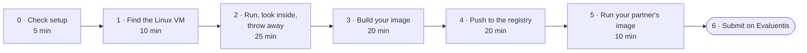
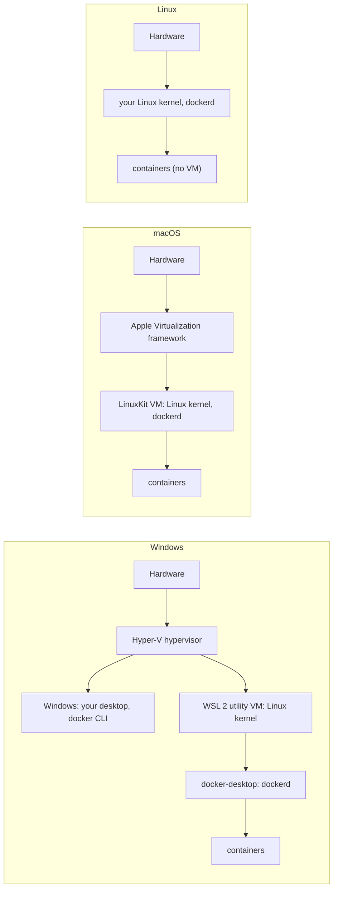
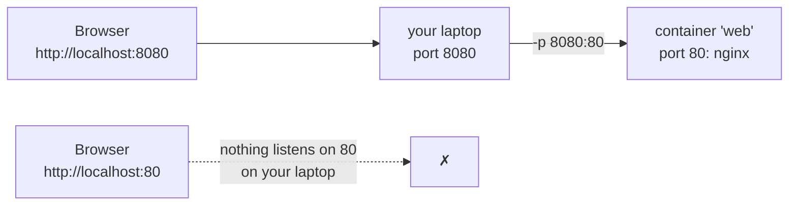
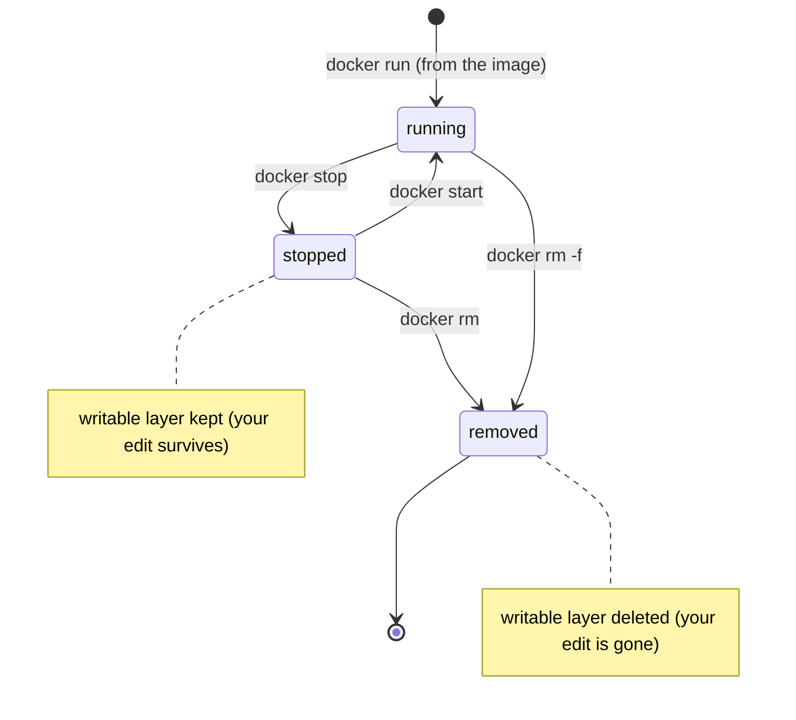
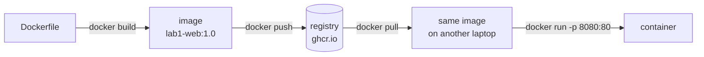
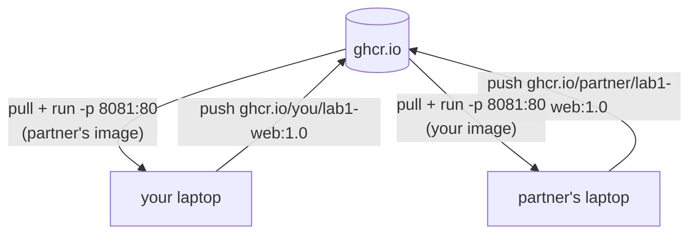

# Lab 1 · Ship it

**From `docker run` to an image a classmate runs on their laptop**

DevOps (ELE1013M) · Turiba University · Session 1 · ≈ 90 minutes · individual work, one step with a partner
Theory: Session 1 slides "From virtualization to containers" (BATIS) · Background reading (BATIS): Agarwal, *Modern DevOps Practices* 2e, ch. 3, "Installing Docker" and "Running your first container"; Krief, *Learning DevOps* 2e, ch. 9, from the Dockerfile to pushing to Docker Hub

| | |
|-|-|
| **You will** | Find the Linux VM on your laptop, run and inspect containers, write your first Dockerfile, push the image to a registry, and run a classmate's image |
| **You hand in** | A link on Evaluentis to `lab1/README.md` in your fork of the course repo, with your public image address, its digest, a screenshot of your partner's image running on your laptop, and four short answers |
| **Passed when** | The lecturer can `docker pull` and `docker run` your image and sees your page, and the README is complete (checklist in Part 6) |



---

## How to read this guide

- Type the commands. Don't copy and paste them. The entry test showed that recognising a command and typing it from memory are different skills, and this lab is where the second one starts.
- `<you>` means your GitHub username in **lowercase**, and `<partner>` your partner's. Remove the angle brackets.
- Commands are written for **bash**:
  - **Windows:** use the **Ubuntu (WSL)** terminal; Docker Desktop must have *Settings → Resources → WSL integration → Ubuntu* switched on.
  - **macOS / Linux:** use Terminal.
  - Where PowerShell needs something different, it is marked **PowerShell:**.
- ✅ **Checkpoint** boxes tell you what you should see. If you see something else, check the troubleshooting table at the end before asking.
- Keep a text file open for notes. You need some outputs for the README in Part 6.

---

## Part 0 · Before you start (5 min)

Docker Desktop (or Rancher Desktop) must be **running**: the engine status says "running".

```bash
docker version            # two sections: Client and Server. Server = the engine
docker run --rm hello-world
git --version
```

✅ **Checkpoint:** `docker version` shows a **Server** section with `OS/Arch: linux/amd64` or `linux/arm64`, and `hello-world` prints "Hello from Docker!". If the Server part says "Cannot connect to the Docker daemon", Docker Desktop is not running.

You also need:
- a GitHub account with two-factor authentication on
- your fork of the course repository cloned to your laptop (pre-course setup step 5)

**Optional but useful:** log in to Docker Hub with a free account (`docker login`). Anonymous pulls are limited per IP address, and the whole room shares the university's address.

---

## Part 1 · Find the Linux on your laptop (10 min)

Containers need a Linux kernel. Unless your laptop runs Linux, that kernel lives in a virtual machine. Find it.

**Windows (PowerShell):**

```powershell
wsl -l -v                 # lists Linux distributions; VERSION 2 = runs in the WSL 2 VM
wsl --status
```

**Everyone:**

```bash
docker info --format '{{.OperatingSystem}} | kernel {{.KernelVersion}} | {{.Architecture}} | {{.NCPU}} CPUs | {{.MemTotal}} bytes'
docker run --rm alpine uname -r
docker run --rm ubuntu:24.04 uname -r
docker run --rm ubuntu:24.04 head -2 /etc/os-release
docker run --rm alpine head -2 /etc/os-release
```



✅ **Checkpoint:**
- On Windows, `wsl -l -v` lists `docker-desktop` (and usually `Ubuntu`) with VERSION 2.
- `docker info` says `Docker Desktop` and a kernel ending in `-microsoft-standard-WSL2` (Windows) or `-linuxkit` (macOS).
- **Both** `uname -r` commands print **the same kernel**, while the two `os-release` files name **different distributions** (Ubuntu and Alpine).

📝 **Note for the README:** copy the `docker info` line and the `uname -r` output. You need them for question 1.

---

## Part 2 · Run, look inside, throw away (25 min)

### 2.1 What `hello-world` told you

Run `docker run --rm hello-world` again and read the four numbered steps it prints. They are the client → daemon → pull → create → run chain from the theory slides. `--rm` deletes the container when it exits.

### 2.2 Run a web server

```bash
docker run -d --name web -p 8080:80 nginx:stable-alpine
```

| Part | Meaning |
|------|---------|
| `-d` | Detached: run in the background and give the terminal back |
| `--name web` | A name, so you don't have to use the random ID |
| `-p 8080:80` | Port **8080 on your laptop** → port **80 in the container** (HOST:CONTAINER) |
| `nginx:stable-alpine` | Image `nginx`, tag `stable-alpine` (pulled from Docker Hub the first time) |

Open **http://localhost:8080** in your browser.



✅ **Checkpoint:** the browser shows "Welcome to nginx!". Port **8080** works and port 80 doesn't, because nothing on your laptop listens on 80. The container's port 80 is only reachable through the mapping.

### 2.3 Observe it from outside

```bash
docker ps                                   # running containers: ID, image, status, ports, name
docker logs web                             # nginx's access log: one line per browser request
docker logs -f web                          # follow live: reload the browser, watch lines appear. Ctrl+C to stop following
docker inspect web                          # everything Docker knows, as JSON
docker inspect -f '{{range .NetworkSettings.Networks}}{{.IPAddress}}{{end}}' web   # the container's own IP (inside the VM)
docker inspect -f '{{.Image}}' web                         # the image ID (sha256:…)
docker top web                              # the container's processes, seen from the host side
docker stats --no-stream                    # CPU and memory use right now
```

**PowerShell:** the `-f '{{…}}'` format strings work as written.

### 2.4 Go inside

```bash
docker exec -it web sh
```

You now have a shell **inside** the running container. The prompt changes to `/ #`: you are root, in `/`.

```sh
cat /etc/os-release | head -2      # Alpine Linux
hostname                           # the container ID
ps                                 # nginx master is PID 1, plus worker processes
ls /usr/share/nginx/html           # the files nginx serves
echo '<h1>Changed inside the container</h1>' > /usr/share/nginx/html/index.html
exit
```

Reload **http://localhost:8080**. Your change is live.

### 2.5 The lifecycle: what survives?

```bash
docker stop web          # SIGTERM to PID 1, the container stops
docker ps                # gone from the list…
docker ps -a             # …but still exists: STATUS "Exited (0)"
docker start web         # start the SAME container again
```

Reload the browser: **your change is still there**. Stopping does not delete the container's writable layer.

```bash
docker rm -f web                                          # remove the container (-f: stop it first)
docker run -d --name web -p 8080:80 nginx:stable-alpine   # a NEW container from the same image
```

Reload the browser: **"Welcome to nginx!" is back.** Your change was in the old container's writable layer, and `docker rm` deleted it. The image never changed.



📝 **Note for the README:** this is question 3.

### 2.6 Limits: cgroups you can see

```bash
docker run -d --name limited --memory 64m --cpus 0.5 nginx:stable-alpine
docker stats --no-stream limited                               # MEM LIMIT column = 64MiB
docker exec limited cat /sys/fs/cgroup/memory.max              # 67108864
docker exec limited cat /sys/fs/cgroup/cpu.max                 # 50000 100000
docker rm -f limited
```

✅ **Checkpoint Part 2:**
- `docker ps -a` lists only `web`.
- You can say in one sentence why the edited page disappeared.
- `memory.max` showed 67108864 (64 MiB).

---

## Part 3 · Your first image (20 min)

### 3.1 The files

In your clone of the course repository, create a folder `lab1/` with two files. Write your own name and a fact about you in the page; your partner will see it.

`lab1/index.html`:

```html
<!doctype html>
<html lang="en">
<head><meta charset="utf-8"><title>Lab 1 · Your Name</title></head>
<body style="font-family: sans-serif; max-width: 40rem; margin: 4rem auto;">
  <h1>Hello from Your Name</h1>
  <p>This page was built into a container image and shipped through a registry.</p>
  <p>A fact about me: …</p>
  <p><small>DevOps (ELE1013M) · Lab 1 · version 1.0</small></p>
</body>
</html>
```

`lab1/Dockerfile`, five lines:

```dockerfile
FROM nginx:stable-alpine
LABEL org.opencontainers.image.source="https://github.com/<you>/turiba-devops-labs"
LABEL org.opencontainers.image.description="Lab 1 static page by Your Name"
COPY index.html /usr/share/nginx/html/index.html
EXPOSE 80
```

| Line | What it does |
|------|--------------|
| `FROM nginx:stable-alpine` | Start from the nginx image. You inherit everything in it: Alpine Linux, nginx, its config **and its start command** |
| `LABEL …source=` | Metadata. GHCR uses it to link the image to your repository (use your fork's real URL) |
| `LABEL …description=` | Metadata shown on the package page |
| `COPY index.html …` | Copy your file from the folder you build in into the image, replacing nginx's default page |
| `EXPOSE 80` | Documents the port. It does **not** publish it: `-p` does that |

There is no `CMD`. The image inherits nginx's start command from the base image (`docker image inspect nginx:stable-alpine -f '{{.Config.Cmd}}'` shows it).

### 3.2 Build

```bash
cd lab1
docker build -t lab1-web:1.0 .
```

- `-t lab1-web:1.0`: name `lab1-web`, tag `1.0`.
- `.`: the **build context**, the folder whose files `COPY` can use. Forgetting the dot is the most common first error.

Read the output. You should see `[1/2] FROM docker.io/library/nginx:stable-alpine@sha256:…`: Docker resolved the tag to an exact **digest**. Then comes `[2/2] COPY index.html …`, and finally `naming to docker.io/library/lab1-web:1.0`.

### 3.3 Run your image

Port 8080 is still taken by `web` from Part 2. Free it first:

```bash
docker rm -f web
docker run -d --name mypage -p 8080:80 lab1-web:1.0
```

Open **http://localhost:8080**. Your page should appear.

### 3.4 Look at what you built

```bash
docker image ls lab1-web
docker history lab1-web:1.0
docker image inspect lab1-web:1.0 -f '{{.Os}}/{{.Architecture}}'
```

✅ **Checkpoint Part 3:** your page shows on port 8080.
- `docker image ls` shows `lab1-web 1.0` at roughly 50–80 MB.
- `docker history` shows your `COPY` line on top of nginx's own lines.
- `inspect` prints `linux/amd64` or `linux/arm64`. Remember which one: it matters in Part 4.

📝 **Note for the README:** your page is about 1 KB, but the image is tens of MB. Where do you think the rest comes from? (Question 4. We answer it properly in S2.)

### 3.5 A second version

Change the version text in `index.html` to `1.1`, then:

```bash
docker build -t lab1-web:1.1 .
docker image ls lab1-web          # both tags exist, with different IMAGE IDs
```

A tag is a name you choose. `1.0` still points to the old image. Build output for 1.1 shows `CACHED` for the `FROM` step: Docker reused the base layers.

---

## Part 4 · Ship it to a registry (20 min)

A **registry** stores images so other machines can pull them. We use **GitHub Container Registry (GHCR)**: same account as your code, and the CI pipelines in S5 will push there too. Docker Hub works as well (box at the end of this part).



### 4.1 Create a token for the registry

GitHub → your avatar → **Settings → Developer settings → Personal access tokens → Tokens (classic) → Generate new token (classic)**

| Field | Value |
|-------|-------|
| Note | `devops-course-ghcr` |
| Expiration | Custom: the end of the semester |
| Scopes | ✅ `write:packages` (this also ticks `read:packages`) |

Copy the token (`ghp_…`) **now**: GitHub shows it only once. Treat it like a password. Never put it in a file in your repository, a screenshot or a chat.

### 4.2 Log in

```bash
docker login ghcr.io -u <you>
```

Paste the token when it asks for **Password** (nothing appears while you paste; that's normal).

✅ **Checkpoint:** `Login Succeeded`. Docker Desktop stores the credential in your OS keychain, so you only do this once.

### 4.3 Tag and push

The registry address is part of the image name: `ghcr.io/<you>/<image>:<tag>`. All lowercase.

```bash
docker tag lab1-web:1.0 ghcr.io/<you>/lab1-web:1.0
docker push ghcr.io/<you>/lab1-web:1.0
```

The last line of the push output looks like `1.0: digest: sha256:4f9c… size: 1234`.

📝 **Note for the README:** copy the **digest**. It is the fingerprint of exactly what you pushed.

### 4.4 Build for both CPU types

Your classmates use two kinds of CPU. An image built on an Apple Silicon Mac is `linux/arm64`; most Windows laptops are `linux/amd64`. A single-platform image fails on the other kind with `no matching manifest` or `exec format error`. Build and push both platforms in one go, **from the `lab1` folder**:

```bash
docker buildx build --platform linux/amd64,linux/arm64 \
  -t ghcr.io/<you>/lab1-web:1.0 --push .
docker buildx imagetools inspect ghcr.io/<you>/lab1-web:1.0
```

**PowerShell:** write it on one line, or replace the trailing `\` with a backtick `` ` ``.

✅ **Checkpoint:** `imagetools inspect` lists two manifests, `linux/amd64` and `linux/arm64`. The digest printed at the top (the *index* digest) is the one to put in your README; it replaces the one from 4.3.

If buildx says that multi-platform builds are not supported for the `docker` driver, see the troubleshooting table.

### 4.5 Make it public

New GHCR packages are **private**: only you can pull them.

GitHub → your profile → **Packages** → `lab1-web` → **Package settings** (bottom right) → *Danger Zone* → **Change visibility** → **Public** → type the name to confirm.

While you're there, check that the package shows your repository under "Connected repository". The `LABEL …source` line did that. If it isn't connected, use **Connect repository**.

✅ **Checkpoint:** open `https://github.com/users/<you>/packages/container/package/lab1-web` in a **private/incognito** browser window. If you can see the page without logging in, the image is public.

> **Docker Hub instead of GHCR.** Create an access token at hub.docker.com → Account settings → Personal access tokens. Then:
>
> ```bash
> docker login -u <dockerid>
> docker tag lab1-web:1.0 <dockerid>/lab1-web:1.0
> docker push <dockerid>/lab1-web:1.0
> ```
>
> The buildx command in 4.4 also works with `-t <dockerid>/lab1-web:1.0`. New repositories on a free personal account are public unless you changed the default.

---

## Part 5 · Run your partner's image (10 min)

The lecturer pairs you up. Send your partner your full image address, for example `ghcr.io/<you>/lab1-web:1.0`, and your digest.

```bash
docker run -d --name friend -p 8081:80 ghcr.io/<partner>/lab1-web:1.0
```

Open **http://localhost:8081**. Port 8081 is used because your own page still runs on 8080.

**Check that you got exactly what they pushed:**

```bash
docker image inspect -f '{{index .RepoDigests 0}}' ghcr.io/<partner>/lab1-web:1.0
```

Compare the `sha256:` value with the digest your partner sent you. They must be identical.



**Take one screenshot** that shows both of these:
- the browser at `localhost:8081` with your **partner's** page
- a terminal with the output of `docker ps` that lists the `friend` container and your partner's image

Save it as `lab1/partner-run.png`.

✅ **Checkpoint Part 5:** you see your partner's name in your browser, and the digests match.

---

## Part 6 · Write it up and submit (5–10 min)

Create `lab1/README.md` from this template and fill it in:

```markdown
# Lab 1 · Ship it

- **Image:** `ghcr.io/<you>/lab1-web:1.0`
- **Digest:** `sha256:…`
- **Platforms:** linux/amd64, linux/arm64
- **Partner's image I ran:** `ghcr.io/<partner>/lab1-web:1.0` (digest matched: yes/no)


## Answers

1. Where does the kernel used by your containers come from on your laptop? Paste the `docker info` / `uname -r` output that proves it.
2. What is the difference between `lab1-web:1.0` and `mypage`?
3. In Part 2 your edit to `index.html` survived `docker stop` but not `docker rm`. Why?
4. Your page is about 1 KB, the image is tens of MB. What do you think the rest is?
```

Commit and push the folder to your fork:

```bash
cd ..                                   # back to the repository root
git add lab1
git commit -m "Lab 1: static page image"
git push
```

Git is covered properly in S3. If `git push` fails, upload the four files on GitHub instead: *Add file → Upload files* in your fork.

**Submit on Evaluentis** → *Lab 1* assignment: the link to `lab1/README.md` in your fork on GitHub.

**Pass checklist** (the lecturer checks each item):

| ✔ | Check |
|---|-------|
| ☐ | `docker pull ghcr.io/<you>/lab1-web:1.0` works without logging in (public) |
| ☐ | `docker run -p 8080:80 …` shows **your** page, with your name |
| ☐ | The image has both `linux/amd64` and `linux/arm64` |
| ☐ | `lab1/` contains `Dockerfile`, `index.html`, `README.md`, `partner-run.png` |
| ☐ | README: image address, digest, partner's image, four answers |
| ☐ | No token or password anywhere in the repository |

---

## Part 7 · Clean up

```bash
docker rm -f mypage friend
docker image ls
docker system df                       # how much space images, containers and cache use
docker image prune                     # remove dangling images (answer y)
```

Keep `lab1-web` and `nginx:stable-alpine`: S2 starts from them.

---

## Troubleshooting

| Symptom | Likely cause | Fix |
|---------|--------------|-----|
| `Cannot connect to the Docker daemon` | Docker Desktop not running, or still starting | Start it and wait until the engine shows "running" |
| Docker Desktop: "WSL 2 is not installed" / "Virtualization not enabled" | Virtualization off in BIOS/UEFI, or Hyper-V / Virtual Machine Platform / WSL disabled (an old VirtualBox guide told you to switch them off) | Task Manager → Performance → CPU must say "Virtualization: Enabled". Then `wsl --install` and `wsl --update` in an admin PowerShell, reboot |
| Linux: `permission denied … /var/run/docker.sock` | Your user is not in the `docker` group | `sudo usermod -aG docker $USER`, then log out and back in |
| `docker: command not found` in WSL Ubuntu | WSL integration is off | Docker Desktop → Settings → Resources → WSL integration → enable Ubuntu → Apply & restart |
| `Bind for 0.0.0.0:8080 failed: port is already allocated` | Another container (or program) uses 8080 | `docker ps` → `docker rm -f <name>`, or use another host port: `-p 8082:80` |
| Browser: "connection refused" on localhost:8080 | Container not running, or wrong port order | `docker ps`. The mapping must be `-p 8080:80` (HOST:CONTAINER) |
| Your page doesn't change after a rebuild | You run the old tag or the old container | `docker rm -f mypage`, run the new tag (`:1.1`) |
| Browser still shows "Welcome to nginx!" for your image | `COPY` target path wrong, or the file name differs | Must be exactly `/usr/share/nginx/html/index.html`; `docker run --rm lab1-web:1.0 ls /usr/share/nginx/html` |
| `"docker build" requires exactly 1 argument` | The `.` is missing | `docker build -t lab1-web:1.0 .` |
| `failed to read dockerfile: open Dockerfile: no such file` | You are not in the `lab1` folder, or the file is `Dockerfile.txt` | `cd lab1`; on Windows show file extensions and rename |
| `invalid reference format: repository name must be lowercase` | Capital letters in the image name | Use your username in lowercase: `ghcr.io/janis-berzins/…` |
| `denied: permission_denied … scopes` or `unauthorized` on push | Token without `write:packages`, wrong username, or a fine-grained token | New **classic** token with `write:packages`; `docker login ghcr.io -u <you>` again |
| Partner: `unauthorized` or `denied` on pull | Package is still private | Part 4.5: change visibility to Public |
| `no matching manifest for linux/amd64` or `exec format error` | Image built for one CPU type only | Part 4.4: `buildx --platform linux/amd64,linux/arm64 --push` |
| `Multi-platform build is not supported for the docker driver` | Docker uses the classic image store | `docker buildx create --name multi --driver docker-container --use`, then repeat 4.4. (Or Docker Desktop → Settings → General → *Use containerd for pulling and storing images*) |
| `toomanyrequests: You have reached your pull rate limit` | Docker Hub allows 100 anonymous pulls per 6 hours per IP, and the room shares one IP | `docker login` with a free Docker Hub account (200 pulls / 6 h), then retry |
| PowerShell: `head` or `grep` not recognised | Those are Linux tools | Run them inside the container (`docker run --rm alpine head …`) or use the WSL Ubuntu terminal |
| Corporate laptop: pulls time out | Proxy or firewall | Docker Desktop → Settings → Resources → Proxies, or use GitHub Codespaces (starter repo has a dev container) |

---

## Stretch tasks (for fast finishers)

| Task | What you learn |
|------|----------------|
| Push `1.1` too. Your partner pulls it and sees the new version while `1.0` still works | Tags are versions; old ones stay pullable |
| Also tag and push `latest`. Then change the page, push `latest` again, and ask your partner what `docker run …:latest` shows *without* a new pull | Why `latest` is not "newest" (S2) |
| `docker save lab1-web:1.0 -o lab1.tar`, look inside with `tar -tf lab1.tar`, then `docker load -i lab1.tar` | An image is just files: JSON + layer archives |
| Run your image in a GitHub Codespace (Docker is preinstalled): `docker run -p 8080:80 ghcr.io/<you>/lab1-web:1.0` | It really runs on a machine you've never configured |
| Write a `HEALTHCHECK` for nginx: `HEALTHCHECK CMD wget -qO- http://127.0.0.1/ \|\| exit 1`. Watch `docker ps` show `(healthy)` | Preview of S2 |
| In WSL Ubuntu: `sudo unshare --pid --fork --mount-proc --uts --net bash`, then `hostname box; ps aux; ip addr` | A "container" with no Docker at all: namespaces by hand |

---

## Command summary

| Goal | Command |
|------|---------|
| Run in the background with a port | `docker run -d --name web -p 8080:80 nginx:stable-alpine` |
| List running / all containers | `docker ps` · `docker ps -a` |
| Logs (follow) | `docker logs web` · `docker logs -f web` |
| Details | `docker inspect web` · `docker inspect -f '{{.Image}}' web` |
| Shell inside | `docker exec -it web sh` |
| Stop / start / remove | `docker stop web` · `docker start web` · `docker rm -f web` |
| Limits | `docker run --memory 64m --cpus 0.5 …` · `docker stats` |
| Build | `docker build -t lab1-web:1.0 .` |
| Images and layers | `docker image ls` · `docker history lab1-web:1.0` |
| Registry login | `docker login ghcr.io -u <you>` |
| Tag and push | `docker tag lab1-web:1.0 ghcr.io/<you>/lab1-web:1.0` · `docker push ghcr.io/<you>/lab1-web:1.0` |
| Multi-platform build and push | `docker buildx build --platform linux/amd64,linux/arm64 -t ghcr.io/<you>/lab1-web:1.0 --push .` |
| Check platforms and digest | `docker buildx imagetools inspect ghcr.io/<you>/lab1-web:1.0` |
| Disk use and cleanup | `docker system df` · `docker image prune` |
