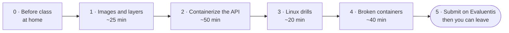

# Lab 2 · Containerize it, then debug it

**From a 1.7 GB "it runs" image to a 250 MB, non-root, reproducible one, and the Linux skills to fix it when it breaks**

DevOps (ELE1013M) · Turiba University · Session 2 · Wednesday 7 October 2026 · theory 16:25–17:55, then this lab at your own pace from 18:15 to 21:30 · individual work
Theory: Session 2 slides "Container images & the Linux survival kit" (BATIS) · Background reading (BATIS): Agarwal, *Modern DevOps Practices* 2e, ch. 3; Krief, *Learning DevOps* 2e, ch. 9 · Docker docs: *Building best practices*, *Multi-stage builds* (docs.docker.com/build)

| | |
|-|-|
| **You will** | See layers, the writable layer and the build cache with your own eyes; turn the course API into a small, non-root image with a health check; practise the Linux basics inside a container; fix broken containers using only shell tools |
| **You hand in** | A link on Evaluentis to `lab2/README.md` in your fork of `turiba-devops-labs`. The fork also contains your `api/Dockerfile`, `api/.dockerignore` and changed `api/server.js`, and your image is public on GHCR |
| **Passed when** | The lecturer can pull and run your image, it passes the checks in Part 5, and the README is complete |
| **Deadline** | **Wednesday 7 October, 22:00** on Evaluentis. The room is open until 21:30 |



---

## How the lab works

Theory comes first, as a fast 90-minute tour. From 18:15 you work through this guide **at your own pace**, with about three hours in the room. Ask questions at any time. **When you have submitted, you can leave.** Some of you will be done in 90 minutes; others need the whole evening. Both are fine.

| Part | Typical time | Theory slides |
|------|-------------:|--------------:|
| 0 · Before class | at home, 15 min | — |
| 1 · Images and layers | 25 min | 6–14b |
| 2 · Containerize the course API | 50 min | 15–24 |
| 3 · Linux drills | 20 min | 25–36 |
| 4 · Fix the broken containers | 40 min | 36, 38 |
| 5 · Write it up and submit | 10 min | — |

- Do the parts **in order**. Part 2 needs the digest from Part 1.
- Stuck on one step for more than 10 minutes? Check the troubleshooting table at the end, then raise your hand.
- Not finished when the room closes at 21:30? Commit and push what works, then finish the rest before 22:00.

---

## How to read this guide

- Type the commands. Don't copy and paste them. Typing is how you learn them, and the self-check at the end of the deck asks you to type them from memory.
- `<you>` means your GitHub username in **lowercase**. Remove the angle brackets.
- Commands are written for **bash**: on Windows use the **Ubuntu (WSL)** terminal, as in Lab 1. Where PowerShell needs something different, it is marked **PowerShell:**. Avoid Git Bash for this lab: it rewrites paths such as `/app` into Windows paths.
- ✅ **Checkpoint** boxes tell you what you should see. If you see something else, check the troubleshooting table at the end before asking.
- 📝 **README** marks a result you need in `lab2/README.md`. Write it down when you get it, not at 21:55.

---

## Part 0 · Before class (at home, 15 min)

The room shares one internet connection and one Docker Hub pull limit (100 pulls per 6 hours for the whole room). Pull the big images **at home**.

```bash
docker login                       # free Docker Hub account: 200 pulls / 6 h, and only yours
docker pull node:24                # over 1 GB: the "naive" baseline
docker pull node:24-slim
docker pull node:24-alpine
docker pull alpine:3.24
docker pull ubuntu:24.04
docker pull nginx:alpine
docker image ls
```

Get the course API into your fork. It is new in the course repository since Lab 1. On GitHub, open **your fork** of `turiba-devops-labs` → **Sync fork** → **Update branch**. Then, on your laptop:

```bash
cd turiba-devops-labs              # your clone from Lab 1
git pull
ls api                             # README.md db.js package-lock.json package.json server.js test validate.js
```

The API is a small todo service in Node.js: `server.js` has the routes, `db.js` the PostgreSQL connection, `validate.js` the input checks, `test/` the unit tests. You don't need Node.js on your laptop; everything runs in containers.

✅ **Checkpoint:** `docker image ls` lists all six images, and `api/` contains `package.json`, `package-lock.json` and `server.js`.

Create the folder for today's notes and exercises:

```bash
mkdir -p lab2
```

---

## Part 1 · Images and layers, hands-on (about 25 min)

### 1.1 Three base images side by side (slides 14, 14b)

```bash
docker image ls node
docker run --rm node:24 cat /etc/os-release
docker run --rm node:24-slim cat /etc/os-release
docker run --rm node:24-alpine cat /etc/os-release
docker run --rm node:24-alpine id
docker history node:24-alpine
docker image inspect node:24-alpine -f 'Cmd={{.Config.Cmd}} Entrypoint={{.Config.Entrypoint}} User={{.Config.User}}'
```

📝 **README:** fill in the first table: size, distro (`PRETTY_NAME`) and default user for the three node images.

✅ **Checkpoint:** the full image is several times bigger than the other two. All three run as **root** (`uid=0`) unless the Dockerfile says otherwise. `User=` is empty, and empty means root.

### 1.2 One image, two containers (slide 7a)

```bash
docker run -d --name a nginx:alpine
docker run -d --name b nginx:alpine
docker exec a sh -c 'echo hello > /usr/share/nginx/html/a.html'
docker exec a ls /usr/share/nginx/html
docker exec b ls /usr/share/nginx/html
docker diff a
docker ps -s
docker rm -f a b
```

✅ **Checkpoint:** `a.html` exists in `a` but not in `b`. `docker diff a` lists `A /usr/share/nginx/html/a.html`. In `docker ps -s`, **SIZE** is a few bytes or KB (the writable layer); **virtual** is the whole image.

### 1.3 Deleting does not shrink an image (slide 8)

```bash
mkdir -p lab2/cow && cd lab2/cow
```

Create two files.

`Dockerfile.bad`:

```dockerfile
FROM alpine:3.24
RUN dd if=/dev/zero of=/big.file bs=1M count=50
RUN rm /big.file
```

`Dockerfile.good`:

```dockerfile
FROM alpine:3.24
RUN dd if=/dev/zero of=/big.file bs=1M count=50 && rm /big.file
```

```bash
docker build -f Dockerfile.bad -t cow:bad .
docker build -f Dockerfile.good -t cow:good .
docker image ls cow
docker history cow:bad
cd ../..
```

📝 **README:** the size of `cow:bad` and `cow:good`.

✅ **Checkpoint:** `cow:bad` is about 50 MB bigger than `cow:good`, although `/big.file` does not exist in either container. `docker history cow:bad` shows a 52 MB layer from `dd` and a tiny layer (a few kB) from `rm`: the delete only adds a marker.

### 1.4 The build cache in action (slides 9, 10c)

```bash
mkdir -p lab2/cache && cd lab2/cache
echo "express 5" > deps.txt
echo "version 1" > app.txt
```

`Dockerfile`:

```dockerfile
FROM alpine:3.24
WORKDIR /app
COPY deps.txt .
RUN echo "installing dependencies..." && sleep 15 && cp deps.txt installed.txt
COPY app.txt .
CMD ["cat", "app.txt"]
```

The `sleep 15` stands in for a slow `npm ci`.

```bash
docker build --progress=plain -t cache-demo .        # a: first build, about 15 s
echo "version 2" > app.txt
docker build --progress=plain -t cache-demo .        # b: only the code changed
echo "express 5.1" > deps.txt
docker build --progress=plain -t cache-demo .        # c: a dependency changed
```

Now put the lines in the **wrong** order: move `COPY app.txt .` above the `RUN` line. Build once so the new order is in the cache, then change only the code:

```bash
docker build -t cache-demo .                         # rebuild after moving the line
echo "version 3" > app.txt
docker build --progress=plain -t cache-demo .        # d: code changed, wrong order
cd ../..
```

📝 **README:** for builds b, c and d, write down whether the `RUN` step said `CACHED` and how long the build took. The last line of the log gives the time, or use `time docker build …`.

✅ **Checkpoint:** b is fast and its `RUN` step says `CACHED`. c and d each wait 15 s. In d, a code change alone forced the slow step to run again: that is the mistake slide 9 warns about.

### 1.5 Tags and digests (slide 11)

```bash
docker image ls --digests node
docker buildx imagetools inspect node:24-alpine
```

📝 **README:** copy the `Digest:` line printed at the top of `imagetools inspect`. You pin your base image to it in Part 2.

✅ **Checkpoint Part 1:** you can explain in one sentence each why `cow:bad` is big, and why build d was slow.

---

## Part 2 · Containerize the course API (about 50 min)

You build the API image four times. Each version fixes something from slides 15–24, and you measure the result.

### 2.1 The naive image (8 min)

`api/Dockerfile`:

```dockerfile
FROM node:24
WORKDIR /app
COPY . .
RUN npm install
CMD ["npm", "start"]
```

```bash
cd api
docker build -t course-api:naive .
docker image ls course-api
docker run -d --name api -p 8080:5000 course-api:naive
docker logs api
curl -s http://localhost:8080/
```

📝 **README:** the size of `course-api:naive`.

✅ **Checkpoint:** the image is well over 1 GB (about 1.7 GB). `curl` returns `{"name":"course-api","version":"0.1.0"}`. `docker logs api` shows two lines:
- `API listening on port 5000`
- `Database not reachable (getaddrinfo ENOTFOUND db) …`

That second line is expected: the database arrives in S4. Until then `/api/todos` answers 500.

### 2.2 `.dockerignore`: keep secrets out (5 min, slides 17, 20, 21)

Real projects have a local `.env` file with passwords. Make one:

```bash
echo "DB_PASSWORD=SuperSecret123" > .env
docker build -t course-api:naive .
docker run --rm course-api:naive cat /app/.env
docker run --rm course-api:naive ls -a /app
```

✅ **Checkpoint:** the password is printed: it is **inside the image**, and anyone who pulls the image can read it. `ls` also shows the `Dockerfile` and everything else in the folder. The repository's `.gitignore` keeps `.env` out of Git, but Docker does not read `.gitignore`.

Create `api/.dockerignore`:

```gitignore
node_modules
npm-debug.log*
.git
.env
.env.*
!.env.example
coverage
*.md
Dockerfile*
.dockerignore
```

```bash
docker build -t course-api:naive .
docker run --rm course-api:naive cat /app/.env
docker run --rm course-api:naive ls -a /app
```

✅ **Checkpoint:** `cat: /app/.env: No such file or directory`. `ls` no longer shows `.env` or `Dockerfile`. Keep the `.env` file: the final checks look for it again.

### 2.3 Dependencies first, production only, exec form (7 min, slides 9, 16)

Change `api/Dockerfile` to:

```dockerfile
FROM node:24
WORKDIR /app
COPY package.json package-lock.json ./
RUN npm ci --omit=dev
COPY . .
CMD ["node", "server.js"]
```

| Change | Why |
|--------|-----|
| `COPY package*.json` before `COPY . .` | The `npm ci` layer stays cached until the lockfile changes |
| `npm ci --omit=dev` | Exact versions from the lockfile; no test tools in the image |
| `CMD ["node", "server.js"]` | Exec form: node is PID 1, no npm or shell in between |

```bash
docker build -t course-api:step1 .
```

Change one line in `server.js` (a comment is enough) and build again:

```bash
docker build --progress=plain -t course-api:step1 .
docker image ls course-api
```

📝 **README:** the size of `course-api:step1`.

✅ **Checkpoint:** in the second build the `npm ci` step says `CACHED`, and only `COPY . .` runs.

### 2.4 PID 1, signals and a health endpoint (10 min, slides 16, 22, 32)

First see the problem:

```bash
docker rm -f api
docker run -d --name api -p 8080:5000 course-api:step1
time docker stop api
docker inspect -f '{{.State.ExitCode}}' api
```

**PowerShell:** `Measure-Command { docker stop api }`.

📝 **README:** how long `docker stop` took, and the exit code.

✅ **Checkpoint:** about **10 seconds** and exit code **137**. Node is PID 1 and has no handler for SIGTERM, so the kernel ignores the signal and Docker has to kill it.

Now fix it, and add the health endpoint at the same time. Open `api/server.js` in VS Code. Two comments mark where your code goes.

1. Under `// Lab 2 (step 2.4): add the GET /healthz route here.` add:

```js
app.get('/healthz', (req, res) => res.status(200).json({ status: 'ok' }));
```

It does not touch the database: "the process answers" is all a health check should ask (slide 22).

2. Under `// Lab 2 (step 2.4): add the SIGTERM handler here.` at the end of the file, add:

```js
process.on('SIGTERM', () => {
  console.log('SIGTERM received, closing the server');
  server.close(() => pool.end().then(() => process.exit(0)));
});
```

`server.close` stops taking new requests and lets running ones finish; `pool.end` closes the database connections; then the process exits with 0.

```bash
docker build -t course-api:step1 .
docker rm -f api
docker run -d --name api -p 8080:5000 course-api:step1
curl -s http://localhost:8080/healthz
time docker stop api
docker inspect -f '{{.State.ExitCode}}' api
docker logs api
```

**PowerShell:** use `curl.exe`, not `curl`.

📝 **README:** the new stop time and exit code.

✅ **Checkpoint:** `/healthz` returns `{"status":"ok"}`. `docker stop` takes less than 2 seconds, the exit code is **0**, and the log ends with "SIGTERM received".

### 2.5 Multi-stage, Alpine, non-root, health check (10 min, slides 14a, 18, 19, 22)

Replace `api/Dockerfile` with:

```dockerfile
# syntax=docker/dockerfile:1
FROM node:24-alpine AS deps
WORKDIR /app
COPY package.json package-lock.json ./
RUN --mount=type=cache,target=/root/.npm npm ci --omit=dev

FROM node:24-alpine AS runtime
LABEL org.opencontainers.image.source="https://github.com/<you>/turiba-devops-labs"
ENV NODE_ENV=production PORT=5000
WORKDIR /app
COPY --from=deps --chown=node:node /app/node_modules ./node_modules
COPY --chown=node:node . .
USER node
EXPOSE 5000
HEALTHCHECK --interval=30s --timeout=3s --start-period=10s --retries=3 \
  CMD wget -qO- http://127.0.0.1:5000/healthz || exit 1
CMD ["node", "server.js"]
```

Before you switch to Alpine, check for native modules (slide 14a):

```bash
docker run --rm course-api:step1 find node_modules -name "*.node"
```

It prints nothing: the API is pure JavaScript, so Alpine's musl libc is no problem. In your own projects, if this finds files, use `node:24-slim` in both stages instead.

```bash
docker build -t course-api:lab2 .
docker image ls course-api
docker rm -f api
docker run -d --name api -p 8080:5000 course-api:lab2
docker run --rm course-api:lab2 id
docker ps                                   # wait 10–30 s and run it again
```

📝 **README:** the size of `course-api:lab2` and the percentage reduction against `naive`. Copy the output of `id` and of `docker ps` showing `(healthy)`.

✅ **Checkpoint:** `lab2` is about 250 MB, roughly 85 % smaller than `naive`. `id` prints `uid=1000(node)`. `docker ps` shows `Up … (healthy)` within about 30 s.

### 2.6 Pin the base image (3 min, slide 23)

In **both** `FROM` lines, add the digest you noted in Part 1.5:

```dockerfile
FROM node:24-alpine@sha256:<digest> AS deps
…
FROM node:24-alpine@sha256:<digest> AS runtime
```

```bash
docker build -t course-api:lab2 .
```

✅ **Checkpoint:** the build log's `FROM` line shows exactly your digest.

### 2.7 Final checks (4 min, slide 39)

| Check | Command | Pass if |
|-------|---------|---------|
| Size | `docker image ls course-api` | `lab2` ≤ 50 % of `naive` |
| Non-root | `docker run --rm course-api:lab2 id` | uid ≠ 0 |
| Healthy | `docker ps` | `(healthy)` |
| Clean | `docker run --rm course-api:lab2 ls -la /app` | No `.env`, `.git` or `Dockerfile` in `/app` |
| Cache | Change one line in `server.js`, rebuild | The `npm ci` step says `CACHED` |
| Stops fast | `time docker stop api` | Under 2 s, exit code 0 |

### 2.8 Push to GHCR (5 min)

Same as Lab 1, Part 4. You are still logged in to `ghcr.io`.

```bash
docker buildx build --platform linux/amd64,linux/arm64 \
  -t ghcr.io/<you>/course-api:lab2 --push .
docker buildx imagetools inspect ghcr.io/<you>/course-api:lab2
cd ..
```

Make the package **public**: GitHub → your profile → **Packages** → `course-api` → **Package settings** → **Change visibility** → **Public**.

✅ **Checkpoint Part 2:** `imagetools inspect` lists `linux/amd64` and `linux/arm64`, and the package page opens in a private browser window without logging in.

---

## Part 3 · Linux drills (about 20 min)

You saw these commands on slides 25–36. Now run them yourself in two practice containers and keep the results.

```bash
docker network create labnet
docker run -d --name web --network labnet -p 8081:80 nginx:alpine
docker run -it --name lab --network labnet ubuntu:24.04 bash
apt-get update && apt-get install -y iproute2 iputils-ping curl dnsutils nano less
```

Port 8081 is used here because your API may still run on 8080. If you already created `web` and `lab` while following the theory, reuse them: `docker start web`, then `docker start -ai lab`.

| # | Drill | Slide | 📝 README |
|--:|-------|------:|-----------|
| 3.1 | `cat /etc/os-release` and `uname -r` inside `lab`. Which one belongs to Ubuntu, and which one to your laptop's VM? | 25 | Both outputs + one sentence |
| 3.2 | Create `/lab/devopstools` with `chef tech`, `ansible tech`, `docker tech` (use `nano` or `vi`). Then `sed 's/tech/tools/g' /lab/devopstools > /lab/newtools.txt` | 28 | `cat /lab/newtools.txt` |
| 3.3 | Inside `lab`: `for i in $(seq 20); do curl -s -o /dev/null http://web/nope; done`. Then, on the host: `docker logs web 2>/dev/null \| grep -c '" 404 '` | 29 | The number (should be 20) |
| 3.4 | `mkdir -p /lab && echo secret > /lab/f && chmod 750 /lab/f && ls -l /lab/f`. Then `useradd -m student` and `su - student -c 'cat /lab/f'` | 30 | `ls -l` line + the error the student gets |
| 3.5 | `APP_ENV=staging; sh -c 'echo "child sees: $APP_ENV"'`, then `export APP_ENV=staging` and run the same `sh -c` again | 33 | Both outputs |
| 3.6 | `cat /proc/1/cmdline \| tr '\0' ' '` inside `lab`. From a second terminal: `time docker stop lab` | 32 | What PID 1 is, and the stop time |
| 3.7 | After `docker start -ai lab`: `getent hosts web` and `curl -sI http://web/ \| head -1`. On the host: `docker exec web netstat -ltn` and `curl -sI http://localhost:8081/ \| head -1` | 35 | The outputs + one sentence: why two different addresses reach the same nginx |

✅ **Checkpoint Part 3:** you can explain 3.4 (why `student` gets `Permission denied` while root does not) and 3.6 (why bash as PID 1 takes 10 s to stop).

---

## Part 4 · Fix the broken containers (about 40 min, slides 36, 38)

Seven images, seven faults: `ghcr.io/mleitass/lab2-broken:1` to `:7`. **Rules:** use only `docker ps`, `logs`, `inspect`, `exec`, `run --entrypoint` and the Linux commands from today. Don't look for the Dockerfiles.

**The method (slide 36):** status → logs → config → a shell inside. The exit code tells you where to look.

### 4.1 Worked example: image 1

```bash
docker run -d --name b1 ghcr.io/mleitass/lab2-broken:1
docker ps -a                                      # 1 · status: b1 is Exited (127)
docker logs b1                                    # 2 · logs: … nodemon: not found
docker inspect -f '{{json .Config.Cmd}}' b1       # 3 · config: ["npm","run","dev"]
```

Exit code 127 means "command not found". The logs say which command: `nodemon`. The config shows why it is called: `CMD` runs the `dev` script, and the `dev` script uses `nodemon`. But `nodemon` is a devDependency, and `npm ci --omit=dev` left it out. Written up, that is:

> **lab2-broken:1**
> - **Symptom:** exits immediately, `Exited (127)`, log `sh: nodemon: not found`
> - **Cause:** `CMD ["npm","run","dev"]` needs `nodemon`, a devDependency that the production install leaves out
> - **Fix:** `CMD ["node", "server.js"]`. Production images run the app directly, not the dev script

### 4.2 Now you: images 2–7

Solve **at least five** of them. Start with the hint in the right column.

| # | What you see | Start with |
|--:|--------------|------------|
| 2 | `exec /entrypoint.sh: no such file or directory`, but the file is there | `docker run -it --rm --entrypoint sh <image>`, then `cat -A /entrypoint.sh \| head -3` |
| 3 | Run it with `-p 8082:5000`. It runs, but `curl localhost:8082` → `Empty reply from server` or `Connection reset by peer` | `docker exec <c> netstat -ltn` (or `ss -ltn`): which address does it listen on? |
| 4 | Logs: `Database not reachable (connect ECONNREFUSED … 127.0.0.1:5432)` | `docker exec <c> env`: who set `DB_HOST`? Then `docker exec <c> ls -la /app` |
| 5 | Exits at once; logs: `EACCES: permission denied, open '/app/data/todos.log'` | It is not running, so no `exec`: `docker run --rm <image> id` and `docker run --rm <image> ls -lnd /app/data` |
| 6 | `docker stop` takes 10 s and ends with exit 137 | `docker exec <c> ps` (or `docker top <c>`): what is PID 1? |
| 7 | `Up (unhealthy)` forever, but the app answers fine | `docker inspect -f '{{json .State.Health}}' <c>` |

Clean up after each one: `docker rm -f <c>`.

📝 **README:** for each image you solved, three lines: **symptom → cause → fix** (the Dockerfile or code change you would make).

✅ **Checkpoint Part 4:** at least five of images 2–7 written up.

---

## Part 5 · Write it up and submit (about 10 min)

Create `lab2/README.md` from this template and fill it in. Put command outputs in code blocks.

```markdown
# Lab 2 · Containerize it, then debug it

- **Image:** `ghcr.io/<you>/course-api:lab2` (public, linux/amd64 + linux/arm64)
- **Base image digest:** `node:24-alpine@sha256:…`

## Part 1 · Images and layers

| Image | Size | Distro | Default user |
|-------|-----:|--------|--------------|
| node:24 | | | |
| node:24-slim | | | |
| node:24-alpine | | | |

cow:bad = … MB · cow:good = … MB

| Build | RUN step CACHED? | Build time |
|-------|------------------|-----------:|
| b · app.txt changed | | |
| c · deps.txt changed | | |
| d · app.txt changed, wrong order | | |

## Part 2 · The course API image

| Step | Image | Size |
|------|-------|-----:|
| Naive | course-api:naive | |
| + .dockerignore, npm ci --omit=dev, exec form | course-api:step1 | |
| Multi-stage, node:24-alpine, non-root | course-api:lab2 | |
| Reduction against naive | | … % |

docker stop before the SIGTERM handler: … s, exit code … · after: … s, exit code …

Output of `docker run --rm course-api:lab2 id`:

Output of `docker ps` showing (healthy):

## Part 3 · Linux drills

3.1 … 3.7 (outputs and one-line explanations)

## Part 4 · Broken containers

### lab2-broken:N
- Symptom:
- Cause:
- Fix:

## Answers

1. `cow:bad` contains no `/big.file`, yet it is 50 MB bigger than `cow:good`. Why?
2. Why does the order of `COPY` and `RUN` lines decide how long a rebuild takes?
3. Why did `docker stop` take 10 seconds before you added the SIGTERM handler?
4. Name three things the naive image contained that `course-api:lab2` does not.
```

Commit and push:

```bash
git add api lab2                        # .env stays out: .gitignore excludes it
git commit -m "Lab 2: multi-stage non-root API image"
git push
```

If `git push` fails, upload the files on GitHub instead (*Add file → Upload files*). Git is covered properly in S3.

**Submit on Evaluentis** → *Lab 2* assignment: the link to `lab2/README.md` in your fork. **Deadline: Wednesday 7 October, 22:00.**

**Submitted? You can leave.** Do the one-minute clean-up in Part 6 first.

**Pass checklist** (the lecturer checks each item):

| ✔ | Check |
|---|-------|
| ☐ | `api/Dockerfile`: multi-stage, every `FROM` pinned with `@sha256:`, `USER` is not root, exec-form `CMD`, `HEALTHCHECK` |
| ☐ | `api/.dockerignore` excludes at least `node_modules`, `.env` and `.git` |
| ☐ | `docker pull ghcr.io/<you>/course-api:lab2` works without logging in, on amd64 and arm64 |
| ☐ | `docker run -p 8080:5000 …` → `/healthz` returns 200 and the container becomes `(healthy)` |
| ☐ | `lab2` is at most 50 % of `naive` (size table in the README) |
| ☐ | README: Parts 1–3 filled in, the four answers, and Part 4 for at least five of images 2–7 |
| ☐ | No password or token anywhere in the repository |

---

## Part 6 · Clean up

```bash
docker rm -f api web lab
docker network rm labnet
docker image rm cow:bad cow:good cache-demo
docker system df
docker builder prune                   # build cache (answer y)
```

Keep `course-api:lab2`, `node:24-alpine` and `ubuntu:24.04`. S4 builds on the API image.

---

## Troubleshooting

| Symptom | Likely cause | Fix |
|---------|--------------|-----|
| `toomanyrequests: You have reached your pull rate limit` | The room shares one Docker Hub limit | `docker login` with your own free Docker Hub account, then retry |
| `ls api` shows nothing, or `No such file or directory` | Your fork is not synced yet | GitHub → your fork → **Sync fork** → **Update branch**, then `git pull` (Part 0) |
| `npm ci` … `package.json and package-lock.json … are not in sync` | `package.json` changed, or `npm install` ran on your laptop and rewrote the lockfile | Restore both: `git checkout -- package.json package-lock.json` (inside `api/`) |
| `cat: 'C:/Program Files/Git/app/.env': No such file or directory` | You are in Git Bash, which rewrites `/app` into a Windows path | Use the WSL Ubuntu terminal (or PowerShell) |
| `failed to compute cache key: … "/package-lock.json": not found` | Wrong folder, or `.dockerignore` excludes it | Build from inside `api/`; check that `.dockerignore` does not list `package*.json` |
| `Bind for 0.0.0.0:8080 failed: port is already allocated` | The old `api` container still runs | `docker rm -f api`, then run again |
| `Conflict. The container name "/api" is already in use` | Same | `docker rm -f api` |
| `curl` in PowerShell prints a table or asks questions | PowerShell's `curl` is an alias | Use `curl.exe`, or the WSL Ubuntu terminal |
| `/healthz` returns `{"error":"not found"}` | The route is not under its marker comment (it must come before the 404 handler), or the image was not rebuilt | Put the line right under `// Lab 2 (step 2.4): add the GET /healthz route here.`; `docker build` again, then `docker rm -f api` and run again |
| `docker stop` still takes 10 s after 2.4 | Old image, or `CMD` still uses `npm` | Rebuild; `CMD ["node", "server.js"]` |
| Container stays `(health: starting)`, then `unhealthy` | The health check calls the wrong port or path, or `wget` is missing | `docker inspect -f '{{json .State.Health}}' api` shows the check's output |
| `EACCES: permission denied` after `USER node` | The app writes into a folder owned by root | `COPY --chown=node:node`, or write to `/tmp` |
| `Error: Cannot find module 'express'` in the `lab2` image | `node_modules` not copied from the `deps` stage, or `.dockerignore` hides `package.json` | Check the `COPY --from=deps` line and `.dockerignore` |
| `Error relocating …` or a segfault (exit 139) on Alpine | A native module built for glibc | Use `node:24-slim` in both stages (Part 2.5) |
| `Multi-platform build is not supported for the docker driver` | Classic image store | `docker buildx create --name multi --driver docker-container --use`, then repeat 2.8 |
| `denied` or `unauthorized` on push | GHCR login expired, or the token lacks `write:packages` | `docker login ghcr.io -u <you>` with your Lab 1 token |
| `vi` is confusing | — | `i` to type, `Esc`, then `:wq` to save and quit or `:q!` to quit without saving (slide 28) |

---

## Stretch tasks (for fast finishers)

| Task | What you learn |
|------|----------------|
| Solve all seven broken images | The full debugging method (slide 36) |
| Runtime on `gcr.io/distroless/nodejs24-debian13:nonroot`. How do you health-check and debug it with no shell? | Slides 14, 25 |
| Run with `--read-only --tmpfs /tmp --cap-drop ALL --security-opt no-new-privileges` and fix what breaks | Slide 31 |
| `ARG GIT_SHA` → `LABEL org.opencontainers.image.revision`, and return it from `/healthz` | Slides 10, 24 |
| `trivy image` or `docker scout quickview`: CVEs of `course-api:naive` against `course-api:lab2` | Slide 14b, preview of S13 |
| Find the deleted 50 MB in `cow:bad` with `dive cow:bad` (github.com/wagoodman/dive) | Slides 7–8 |

---

## Command summary

| Goal | Command |
|------|---------|
| Build, with the full log | `docker build --progress=plain -t course-api:lab2 .` |
| Size, layers, config | `docker image ls course-api` · `docker history course-api:lab2` · `docker image inspect course-api:lab2` |
| Digest of a base image | `docker buildx imagetools inspect node:24-alpine` |
| Writable layer | `docker diff <c>` · `docker ps -s` |
| Who runs it | `docker run --rm course-api:lab2 id` |
| Health | `docker ps` · `docker inspect -f '{{json .State.Health}}' <c>` |
| Stop time and exit code | `time docker stop <c>` · `docker inspect -f '{{.State.ExitCode}}' <c>` |
| Debug | `docker ps -a` → `docker logs <c>` → `docker inspect <c>` → `docker exec -it <c> sh` / `docker run -it --rm --entrypoint sh <image>` |
| Multi-platform push | `docker buildx build --platform linux/amd64,linux/arm64 -t ghcr.io/<you>/course-api:lab2 --push .` |
| Clean up | `docker system df` · `docker builder prune` · `docker image prune` |
